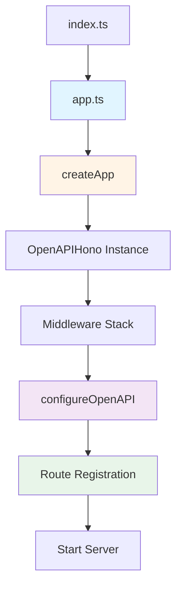

The Hono OpenAPI Starter follows a modular architecture that separates concerns and promotes maintainability. This guide explains how the different components work together to create a type-safe, well-documented API.

## Project Structure

The project is organized into clear, functional directories:

```
src/
├── app.ts              # Application entry point and route registration
├── index.ts            # Server startup
├── env.ts              # Environment configuration
├── db/
│   ├── index.ts        # Database connection
│   └── schema.ts       # Drizzle ORM schemas and Zod validators
├── lib/
│   ├── create-app.ts   # App factory with middleware setup
│   ├── configure-open-api.ts  # OpenAPI documentation config
│   ├── types.ts        # Global type definitions
│   └── constants.ts    # Shared constants
├── middlewares/
│   └── pino-logger.ts  # Request logging middleware
└── routes/
    ├── index.route.ts  # Root endpoint
    └── tasks/
        ├── tasks.index.ts     # Router composition
        ├── tasks.routes.ts    # Route definitions (OpenAPI specs)
        └── tasks.handlers.ts  # Route handlers (business logic)
```

## Application Flow



### 1. Application Bootstrap

The application starts in `app.ts`, which orchestrates the setup:

```typescript title="src/app.ts"
import configureOpenAPI from "@/lib/configure-open-api";
import createApp from "@/lib/create-app";
import index from "@/routes/index.route";
import tasks from "@/routes/tasks/tasks.index";

const app = createApp();

configureOpenAPI(app);

const routes = [
  index,
  tasks,
] as const;

routes.forEach((route) => {
  app.route("/", route);
});

export type AppType = typeof routes[number];

export default app;
```

<Note>
The `AppType` export is crucial for end-to-end type safety. It enables type-safe API clients using Hono's RPC feature.
</Note>

### 2. App Factory Pattern

The `createApp()` function establishes the core application with middleware:

```typescript title="src/lib/create-app.ts"
import { OpenAPIHono } from "@hono/zod-openapi";
import { requestId } from "hono/request-id";
import { notFound, onError, serveEmojiFavicon } from "stoker/middlewares";
import { defaultHook } from "stoker/openapi";

export function createRouter() {
  return new OpenAPIHono<AppBindings>({
    strict: false,
    defaultHook,
  });
}

export default function createApp() {
  const app = createRouter();
  app.use(requestId())
    .use(serveEmojiFavicon("📝"))
    .use(pinoLogger());

  app.notFound(notFound);
  app.onError(onError);
  return app;
}
```

<Accordion title="What is the defaultHook?">
The `defaultHook` from Stoker handles validation errors automatically. When a request fails Zod validation, it returns a properly formatted 422 Unprocessable Entity response with detailed error information.
</Accordion>

## Route Organization

Routes follow a three-file pattern that separates concerns:

### Route Index (Composition)

The index file combines route definitions with their handlers:

```typescript title="src/routes/tasks/tasks.index.ts"
import { createRouter } from "@/lib/create-app";
import * as handlers from "./tasks.handlers";
import * as routes from "./tasks.routes";

const router = createRouter()
  .openapi(routes.list, handlers.list)
  .openapi(routes.create, handlers.create)
  .openapi(routes.getOne, handlers.getOne)
  .openapi(routes.patch, handlers.patch)
  .openapi(routes.remove, handlers.remove);

export default router;
```

### Route Definitions (OpenAPI Specs)

Route definitions declare the API contract using `createRoute()`:

```typescript title="src/routes/tasks/tasks.routes.ts"
import { createRoute, z } from "@hono/zod-openapi";
import { jsonContent, jsonContentRequired } from "stoker/openapi/helpers";
import { insertTasksSchema, selectTasksSchema } from "@/db/schema";

export const create = createRoute({
  path: "/tasks",
  method: "post",
  request: {
    body: jsonContentRequired(
      insertTasksSchema,
      "The task to create",
    ),
  },
  tags: ["Tasks"],
  responses: {
    [HttpStatusCodes.OK]: jsonContent(
      selectTasksSchema,
      "The created task",
    ),
    [HttpStatusCodes.UNPROCESSABLE_ENTITY]: jsonContent(
      createErrorSchema(insertTasksSchema),
      "The validation error(s)",
    ),
  },
});
```

<Info>
Each route definition specifies request validation, response schemas, and OpenAPI documentation in one place. This single source of truth ensures your docs are always in sync with your implementation.
</Info>

### Route Handlers (Business Logic)

Handlers implement the actual business logic:

```typescript title="src/routes/tasks/tasks.handlers.ts"
import type { AppRouteHandler } from "@/lib/types";
import type { CreateRoute } from "./tasks.routes";
import db from "@/db";
import { tasks } from "@/db/schema";

export const create: AppRouteHandler<CreateRoute> = async (c) => {
  const task = c.req.valid("json");
  const [inserted] = await db.insert(tasks).values(task).returning();
  return c.json(inserted, HttpStatusCodes.OK);
};
```

<Tip>
Notice how `c.req.valid("json")` returns a fully typed object. The `AppRouteHandler<CreateRoute>` type ensures the handler matches the route definition, providing complete type safety.
</Tip>

## Middleware Stack

The application uses a carefully ordered middleware stack:

1. **Request ID** - Adds unique ID to each request for tracing
2. **Favicon** - Serves an emoji favicon (📝)
3. **Pino Logger** - Structured logging for all requests
4. **Route Handlers** - Your application logic
5. **Error Handler** - Catches and formats errors consistently
6. **Not Found Handler** - Returns 404 for unknown routes

```typescript
app.use(requestId())           // Generate unique request ID
  .use(serveEmojiFavicon("📝")) // Serve favicon
  .use(pinoLogger());          // Log all requests

app.notFound(notFound);        // Handle 404s
app.onError(onError);          // Handle errors
```

## Database Integration

The database layer uses Drizzle ORM with LibSQL:

```typescript title="src/db/index.ts"
import { drizzle } from "drizzle-orm/libsql";
import * as schema from "./schema";

const db = drizzle({
  connection: {
    url: env.DATABASE_URL,
    authToken: env.DATABASE_AUTH_TOKEN,
  },
  casing: "snake_case",
  schema,
});

export default db;
```

<Note>
The `casing: "snake_case"` option automatically converts JavaScript camelCase to database snake_case, keeping your code idiomatic while following SQL conventions.
</Note>

## Type System

The application defines global types for consistency:

```typescript title="src/lib/types.ts"
import type { OpenAPIHono, RouteConfig, RouteHandler } from "@hono/zod-openapi";
import type { PinoLogger } from "hono-pino";

export interface AppBindings {
  Variables: {
    logger: PinoLogger;
  };
};

export type AppOpenAPI<S extends Schema = {}> = OpenAPIHono<AppBindings, S>;

export type AppRouteHandler<R extends RouteConfig> = RouteHandler<R, AppBindings>;
```

<Accordion title="What are AppBindings?">
`AppBindings` define the context variables available in your route handlers. Here, it provides access to the logger instance. You can extend this to include database connections, authentication data, or any other request-scoped values.
</Accordion>

## OpenAPI Documentation

OpenAPI documentation is configured once and generated automatically:

```typescript title="src/lib/configure-open-api.ts"
import { Scalar } from "@scalar/hono-api-reference";

export default function configureOpenAPI(app: AppOpenAPI) {
  app.doc("/doc", {
    openapi: "3.0.0",
    info: {
      version: packageJSON.version,
      title: "Tasks API",
    },
  });

  app.get("/reference", Scalar({
    url: "/doc",
    theme: "kepler",
    layout: "classic",
  }));
}
```

This configuration:
- Exposes the OpenAPI spec at `/doc`
- Serves interactive API documentation at `/reference` using Scalar
- Automatically includes all routes defined with `createRoute()`

## Key Design Principles

<CardGroup cols={2}>
  <Card title="Separation of Concerns" icon="layer-group">
    Routes, handlers, and schemas are separated into distinct files for clarity and maintainability.
  </Card>
  <Card title="Type Safety" icon="shield-check">
    TypeScript types flow from database schemas through routes to handlers, catching errors at compile time.
  </Card>
  <Card title="Single Source of Truth" icon="database">
    Database schemas generate both runtime validators and TypeScript types, eliminating sync issues.
  </Card>
  <Card title="Developer Experience" icon="heart">
    Sensible defaults, helpful utilities from Stoker, and automatic documentation generation reduce boilerplate.
  </Card>
</CardGroup>

## Next Steps

<CardGroup cols={2}>
  <Card title="Type Safety" href="/concepts/type-safety">
    Learn how types flow from database to API
  </Card>
  <Card title="OpenAPI Integration" href="/concepts/openapi">
    Understand OpenAPI documentation generation
  </Card>
</CardGroup>