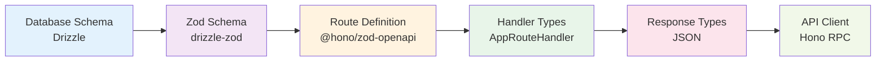

One of the most powerful features of Hono OpenAPI Starter is its complete type safety from the database schema all the way through to API responses and clients. This guide explains how types flow through your application.

## Type Flow Overview



## Layer 1: Database Schema

Everything starts with your Drizzle ORM schema definition:

```typescript title="src/db/schema.ts"
import { integer, sqliteTable, text } from "drizzle-orm/sqlite-core";

export const tasks = sqliteTable("tasks", {
  id: integer({ mode: "number" })
    .primaryKey({ autoIncrement: true }),
  name: text().notNull(),
  done: integer({ mode: "boolean" })
    .notNull()
    .default(false),
  createdAt: integer({ mode: "timestamp" })
    .$defaultFn(() => new Date()),
  updatedAt: integer({ mode: "timestamp" })
    .$defaultFn(() => new Date())
    .$onUpdate(() => new Date()),
});
```

<Note>
Drizzle schemas define both the database structure and TypeScript types. The `mode` option tells Drizzle how to map SQLite types to JavaScript types (e.g., `mode: "boolean"` converts SQLite integers to booleans).
</Note>

## Layer 2: Zod Validation Schemas

From the Drizzle schema, we generate Zod schemas for runtime validation:

```typescript title="src/db/schema.ts"
import { createInsertSchema, createSelectSchema } from "drizzle-zod";
import { toZodV4SchemaTyped } from "@/lib/zod-utils";

// Schema for selecting from database
export const selectTasksSchema = toZodV4SchemaTyped(
  createSelectSchema(tasks)
);

// Schema for inserting into database
export const insertTasksSchema = toZodV4SchemaTyped(
  createInsertSchema(
    tasks,
    {
      name: field => field.min(1).max(500),
    },
  ).required({
    done: true,
  }).omit({
    id: true,
    createdAt: true,
    updatedAt: true,
  })
);

// Schema for partial updates
export const patchTasksSchema = insertTasksSchema.partial();
```

<Accordion title="What does toZodV4SchemaTyped do?">
This utility bridges the gap between Zod v4 (used in your app) and the type expected by `@hono/zod-openapi`. It's a TypeScript type cast that ensures compatibility:

```typescript title="src/lib/zod-utils.ts"
export function toZodV4SchemaTyped<T extends z4.ZodTypeAny>(
  schema: T,
) {
  return schema as unknown as z.ZodType<z4.infer<T>>;
}
```
</Accordion>

### Schema Customization

Notice how we customize the schemas:

1. **Validation rules**: `name: field => field.min(1).max(500)` adds string length constraints
2. **Required fields**: `.required({ done: true })` ensures `done` is always provided
3. **Omitted fields**: `.omit({ id: true, createdAt: true, updatedAt: true })` removes auto-generated fields from input

<Warning>
Always omit auto-generated fields (like `id`, `createdAt`) from insert schemas. These should be set by the database, not provided by users.
</Warning>

## Layer 3: Route Definitions

Route definitions use Zod schemas to specify the API contract:

```typescript title="src/routes/tasks/tasks.routes.ts"
import { createRoute, z } from "@hono/zod-openapi";
import { jsonContent, jsonContentRequired } from "stoker/openapi/helpers";
import { insertTasksSchema, selectTasksSchema } from "@/db/schema";

export const create = createRoute({
  path: "/tasks",
  method: "post",
  request: {
    body: jsonContentRequired(
      insertTasksSchema,
      "The task to create",
    ),
  },
  tags: ["Tasks"],
  responses: {
    [HttpStatusCodes.OK]: jsonContent(
      selectTasksSchema,
      "The created task",
    ),
    [HttpStatusCodes.UNPROCESSABLE_ENTITY]: jsonContent(
      createErrorSchema(insertTasksSchema),
      "The validation error(s)",
    ),
  },
});

export type CreateRoute = typeof create;
```

<Info>
Exporting the route type (`CreateRoute`) is crucial. This type is used to ensure handlers match their route definitions, providing compile-time safety.
</Info>

### Type-Safe Route Parameters

For routes with parameters, Stoker provides reusable schemas:

```typescript title="src/routes/tasks/tasks.routes.ts"
import { IdParamsSchema } from "stoker/openapi/schemas";

export const getOne = createRoute({
  path: "/tasks/{id}",
  method: "get",
  request: {
    params: IdParamsSchema,  // Validates id as a number
  },
  responses: {
    [HttpStatusCodes.OK]: jsonContent(
      selectTasksSchema,
      "The requested task",
    ),
    [HttpStatusCodes.NOT_FOUND]: jsonContent(
      notFoundSchema,
      "Task not found",
    ),
  },
});
```

## Layer 4: Typed Route Handlers

Handlers use the `AppRouteHandler` type to ensure they match their route:

```typescript title="src/routes/tasks/tasks.handlers.ts"
import type { AppRouteHandler } from "@/lib/types";
import type { CreateRoute } from "./tasks.routes";

export const create: AppRouteHandler<CreateRoute> = async (c) => {
  // c.req.valid("json") is fully typed based on CreateRoute
  const task = c.req.valid("json");
  //    ^ type: { name: string; done: boolean }
  
  const [inserted] = await db.insert(tasks).values(task).returning();
  //     ^ type: { id: number; name: string; done: boolean; createdAt: Date; updatedAt: Date }
  
  return c.json(inserted, HttpStatusCodes.OK);
  // TypeScript ensures 'inserted' matches selectTasksSchema
};
```

<Tip>
The `c.req.valid()` method is type-safe. TypeScript knows exactly what shape the validated data will have based on the route definition.
</Tip>

### Handler Type Definition

The `AppRouteHandler` type ensures complete type safety:

```typescript title="src/lib/types.ts"
import type { RouteConfig, RouteHandler } from "@hono/zod-openapi";
import type { PinoLogger } from "hono-pino";

export interface AppBindings {
  Variables: {
    logger: PinoLogger;
  };
};

export type AppRouteHandler<R extends RouteConfig> = 
  RouteHandler<R, AppBindings>;
```

This type:
- Links the handler to its route definition (`R extends RouteConfig`)
- Provides access to context variables (`AppBindings`)
- Ensures request/response types match the route spec

## Layer 5: Automatic Validation

Validation happens automatically thanks to the `defaultHook`:

```typescript title="src/lib/create-app.ts"
import { defaultHook } from "stoker/openapi";

export function createRouter() {
  return new OpenAPIHono<AppBindings>({
    strict: false,
    defaultHook,  // Handles validation automatically
  });
}
```

When a request arrives:

1. Zod validates the request against the schema
2. If valid, the handler receives typed, validated data
3. If invalid, a 422 response is returned automatically with detailed errors

```json title="Example validation error response"
{
  "success": false,
  "error": {
    "issues": [
      {
        "code": "too_small",
        "minimum": 1,
        "type": "string",
        "inclusive": true,
        "path": ["name"],
        "message": "String must contain at least 1 character(s)"
      }
    ],
    "name": "ZodError"
  }
}
```

<Note>
You never write validation code in handlers. The framework handles it based on your schemas, eliminating boilerplate and ensuring consistency.
</Note>

## Layer 6: Response Type Safety

Responses are also type-checked:

```typescript
export const list: AppRouteHandler<ListRoute> = async (c) => {
  const tasks = await db.query.tasks.findMany();
  //    ^ type: Array<{ id: number; name: string; ... }>
  
  return c.json(tasks);
  // TypeScript ensures 'tasks' matches the response schema
};
```

If you try to return data that doesn't match the schema, TypeScript will error at compile time.

## Type-Safe API Clients

The `AppType` export enables end-to-end type safety for API clients:

```typescript title="src/app.ts"
export type AppType = typeof routes[number];
```

Clients can use Hono's RPC feature for fully typed API calls:

```typescript title="Example API client"
import { hc } from "hono/client";
import type { AppType } from "./app";

const client = hc<AppType>("http://localhost:3000");

// Fully typed request and response
const response = await client.tasks.$post({
  json: {
    name: "Build API",
    done: false,
  },
});

if (response.ok) {
  const task = await response.json();
  //    ^ type: { id: number; name: string; done: boolean; ... }
  console.log(task.name);
}
```

<Info>
The client knows the exact types of request bodies, query parameters, and responses. Refactoring your API automatically updates client types.
</Info>

## Type Safety in Practice

Let's walk through a complete example:

### 1. Define the Schema

```typescript
export const tasks = sqliteTable("tasks", {
  id: integer({ mode: "number" }).primaryKey({ autoIncrement: true }),
  name: text().notNull(),
  done: integer({ mode: "boolean" }).notNull().default(false),
});

export const insertTasksSchema = toZodV4SchemaTyped(
  createInsertSchema(tasks, {
    name: field => field.min(1).max(500),
  }).omit({ id: true })
);
```

### 2. Define the Route

```typescript
export const create = createRoute({
  method: "post",
  path: "/tasks",
  request: { body: jsonContentRequired(insertTasksSchema, "Task to create") },
  responses: {
    [HttpStatusCodes.OK]: jsonContent(selectTasksSchema, "Created task"),
  },
});
```

### 3. Implement the Handler

```typescript
export const create: AppRouteHandler<CreateRoute> = async (c) => {
  const task = c.req.valid("json");  // Type: { name: string; done: boolean }
  const [inserted] = await db.insert(tasks).values(task).returning();
  return c.json(inserted);
};
```

### 4. Type-Safe Client

```typescript
const response = await client.tasks.$post({
  json: { name: "New task", done: false },
});
const task = await response.json();  // Type: { id: number; name: string; done: boolean }
```

<Warning>
If you change the database schema, TypeScript will show errors everywhere the types are affected, preventing runtime errors.
</Warning>

## Benefits of This Approach

<CardGroup cols={2}>
  <Card title="Compile-Time Safety" icon="check-circle">
    Catch type mismatches during development, not in production.
  </Card>
  <Card title="Automatic Validation" icon="shield-check">
    No manual validation code needed—schemas handle it all.
  </Card>
  <Card title="Refactoring Confidence" icon="arrows-rotate">
    Change a schema and TypeScript finds every affected line.
  </Card>
  <Card title="Self-Documenting" icon="book">
    Types serve as inline documentation that can't get out of sync.
  </Card>
</CardGroup>

## Common Patterns

### Extending Schemas

You can extend generated schemas with additional validation:

```typescript
export const insertTasksSchema = toZodV4SchemaTyped(
  createInsertSchema(tasks, {
    name: field => field.min(1).max(500).regex(/^[A-Za-z0-9 ]+$/),
    done: field => field.default(false),
  })
);
```

### Nested Objects

For complex nested structures:

```typescript
const userWithTasksSchema = z.object({
  user: selectUsersSchema,
  tasks: z.array(selectTasksSchema),
  metadata: z.object({
    total: z.number(),
    completed: z.number(),
  }),
});
```

### Query Parameters

```typescript
const listQuerySchema = z.object({
  limit: z.string().transform(Number).pipe(z.number().min(1).max(100)).default("10"),
  offset: z.string().transform(Number).pipe(z.number().min(0)).default("0"),
  status: z.enum(["active", "completed", "all"]).default("all"),
});

export const list = createRoute({
  method: "get",
  path: "/tasks",
  request: {
    query: listQuerySchema,
  },
  // ...
});
```

## Next Steps

<CardGroup cols={2}>
  <Card title="Architecture" href="/concepts/architecture">
    Learn about the overall project structure
  </Card>
  <Card title="OpenAPI Integration" href="/concepts/openapi">
    Understand automatic documentation generation
  </Card>
</CardGroup>